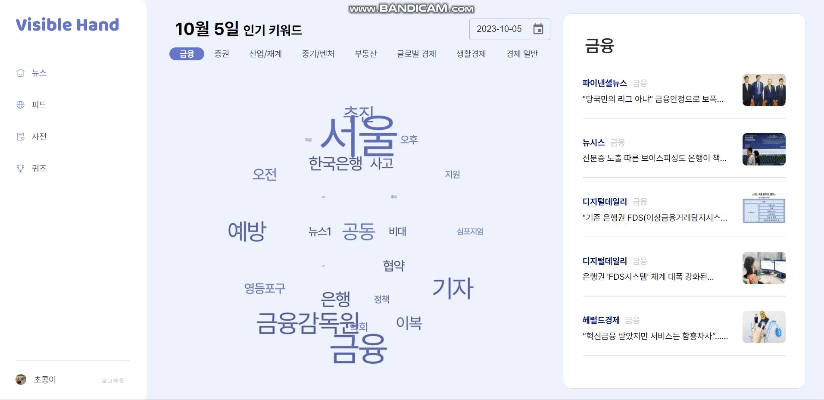
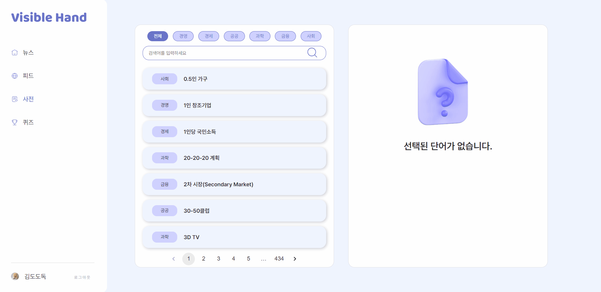
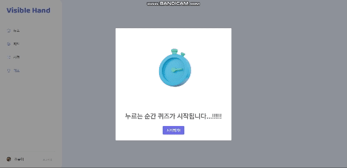
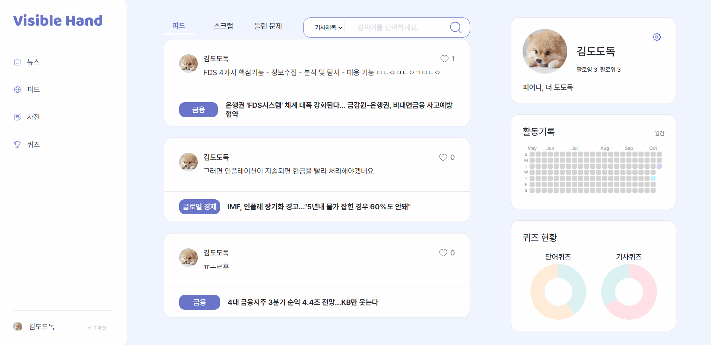
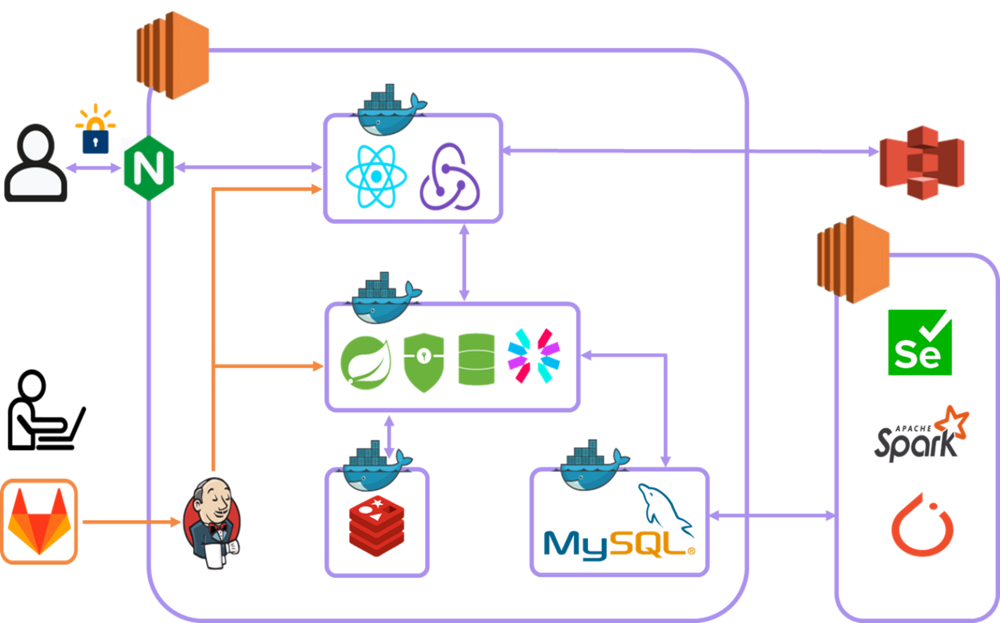
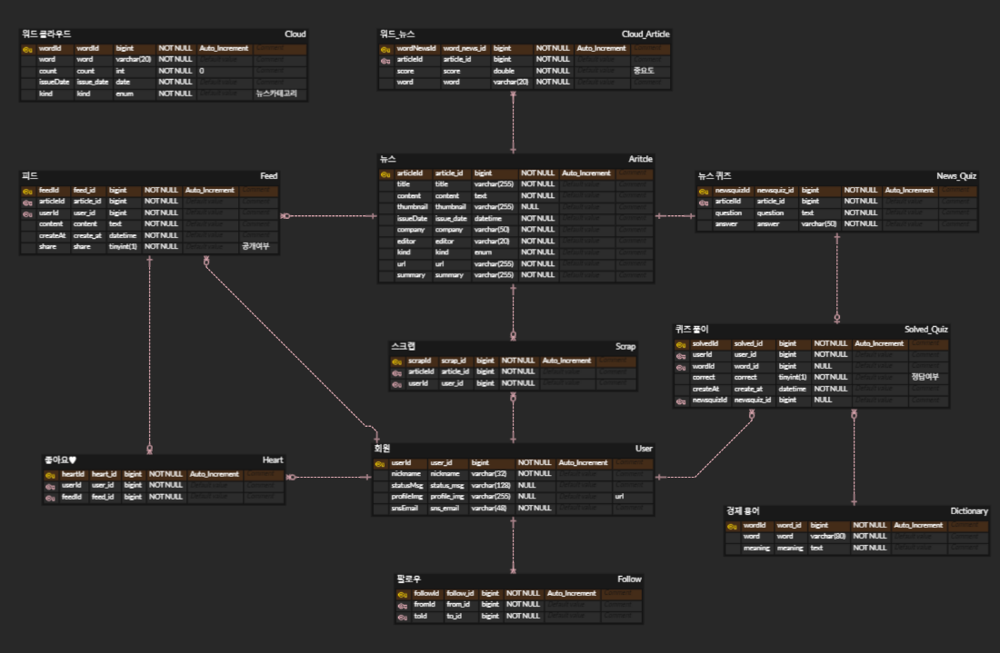
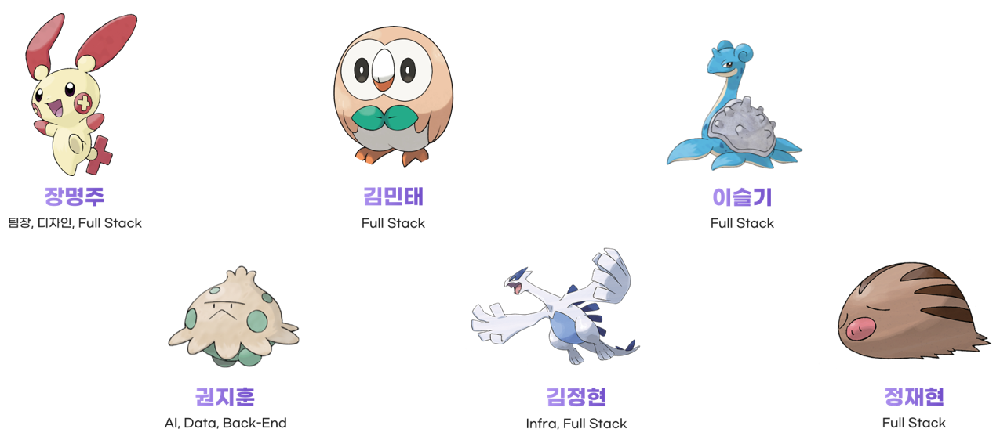

# Visible Hand
 최신 경제 트렌드를 파악하여 시사 상식을 쌓고, 뉴스 기사 학습 및 빈출 용어들을 익히는 경제 학습 플랫폼  
 

## :bulb: [기능소개]
### 1) [온보딩]
{: width="700px"}

### 2) [소셜 로그인] 
{: width="700px"}

### 3) [워드 클라우드] 
- 분야별 상위 25개 단어 워드 클라우드 형태로 제공  
{: width="700px"}

### [뉴스 상세 보기 및 뉴스 퀴즈] 
- 뉴스 글자 크기 조정 기능
- 뉴스 스크랩 기능
- 뉴스 이해도를 학인할 수 있는 퀴즈 제공  
{: width="700px"}

### [피드]
- 팔로우한 유저의 피드 목록 확인 기능  
{: width="700px"}

### [경제 용어 사전]
- 분야별 경제 용어 사전  
{: width="700px"}

### [경제 용어 퀴즈]
{: width="700px"}

### [마이페이지]
- 뉴스에 작성한 피드 확인 기능
- 스크랩한 뉴스 확인 기능
- 경제 용어 퀴즈 문제 풀이 중 틀린 문제만 재풀이 기능 제공  
{: width="700px"}  

## :bulb: 기술 스택

### Cooperation

### Tools

### Infra

### BackEnd

### FrontEnd

### Data

  

## :bulb: 아키텍처
{: width="700px"}  

## :bulb: ERD
{: width="700px"}  

## :bulb: 팀원 소개
{: width="700px"}
